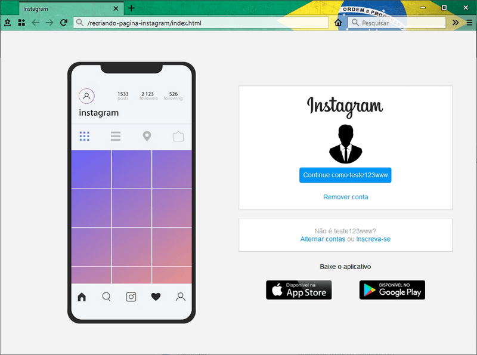
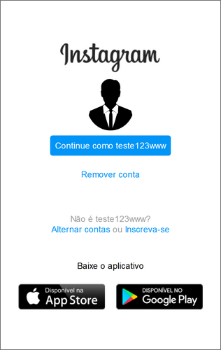

# **Recriando a página inicial do Instagram**

 

Esse é meu primeiro projeto no Github.  

Foi bom ter praticado em HTML e CSS e ter colocado em prática o que aprendi nas aulas de Git e Github.  

Vale lembrar que a página recriada não é a versão mais recente e não tem os links do rodapé, ou seja, a atual página inicial oficial do Instagram tem uma aparência um pouco diferente.

 

### **Captura de tela do desktop**

 

### **Captura de tela do celular**

 

## Observação
Projeto criado para fins didático.

 

## Licença  
Leia mais sobre o assunto, *[aqui](https://github.com/ridns/recriando-pagina-instagram/blob/master/LICENSE)*.
